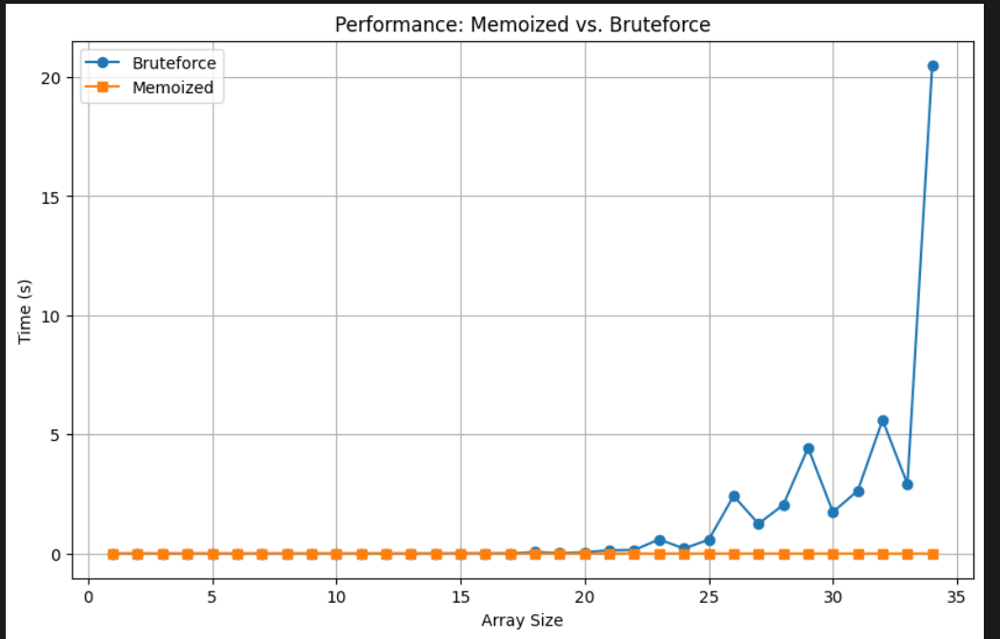
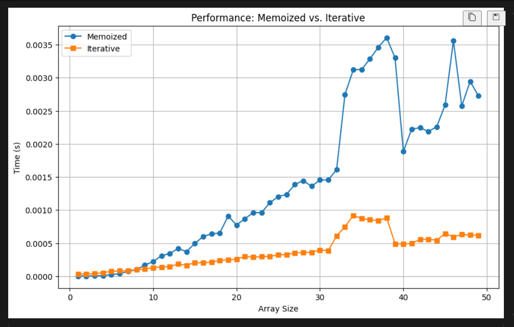
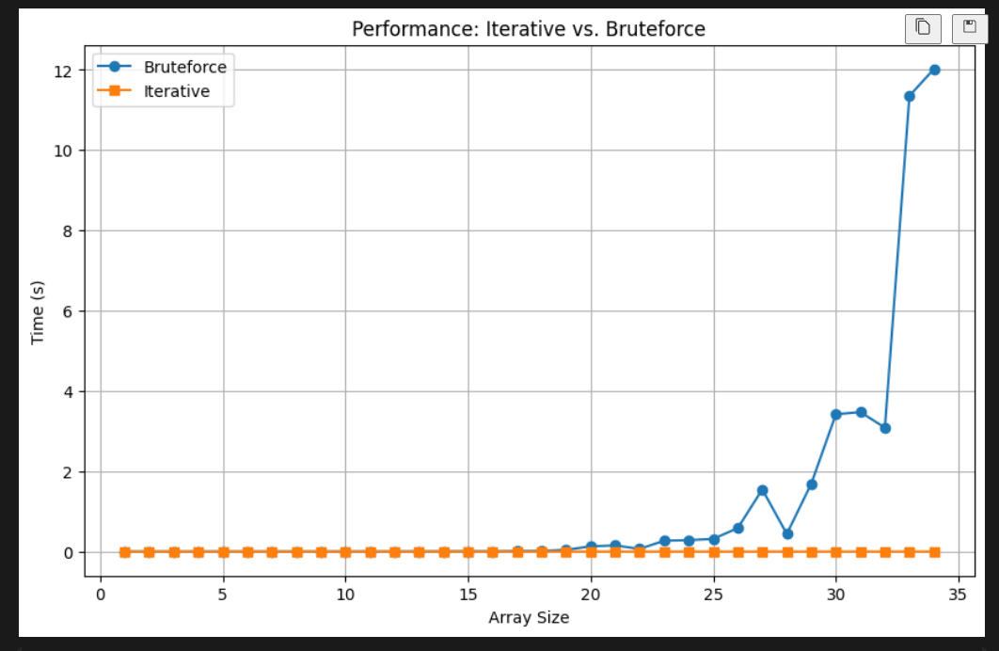
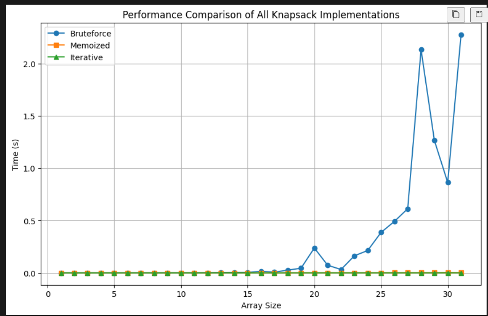
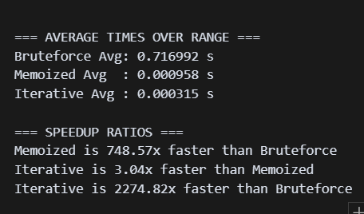

# Knapsack Problem Implementations Comparison

## Overview
This project contains a Jupyter notebook (`knapsack_implementations_comparison.ipynb`) that compares different implementations of the 0/1 Knapsack Problem. The notebook provides insights into the performance and efficiency of various algorithms used to solve the Knapsack Problem.

## Comparison Results
The notebook includes performance comparisons between the following implementations:
- **Bruteforce**: A recursive approach that checks all possible combinations.
- **Memoized**: A dynamic programming approach that uses memoization to improve performance.
- **Iterative**: An iterative dynamic programming approach that builds the solution from the bottom up.

## Time and Space Complexity Analysis

| Implementation | Time Complexity         | Space Complexity        |
|----------------|------------------------|------------------------|
| Bruteforce     | O(2^n)                 | O(n) (due to recursion stack) |
| Memoized       | O(n * W)               | O(n * W)               |
| Iterative      | O(n * W)               | O(W)                   |

Where:
- n = number of items
- W = knapsack capacity

### Performance Visualizations

**Memoized vs. Bruteforce**

**Memoized vs. Iterative**

**Iterative vs. Bruteforce**

**All Implementations Comparison**

**Average Times and Speedup Ratios**

### Key Findings
- The **Memoized** implementation generally outperforms the **Bruteforce** method, especially for larger input sizes, due to its ability to avoid redundant calculations.
- The **Iterative** implementation is the most efficient, providing the best performance across various input sizes.
- The **Bruteforce** method is the slowest, as it has an exponential time complexity.

## Conclusion

The comprehensive analysis and visualizations clearly demonstrate the dramatic differences in efficiency between the three knapsack implementations:

- The **Bruteforce** approach, while conceptually simple, becomes impractically slow as the problem size increases, with exponential growth in computation time.
- The **Memoized** (top-down dynamic programming) method offers a massive speedup—over 700x faster than bruteforce on average—by eliminating redundant calculations, making it suitable for moderately large problems.
- The **Iterative** (bottom-up dynamic programming) implementation is the most efficient, being over 2200x faster than bruteforce and about 3x faster than memoized, while also using less memory. This makes it the preferred choice for large-scale or performance-critical applications.

In summary, for solving the knapsack problem efficiently, dynamic programming approaches (especially the iterative version) are vastly superior to the naive bruteforce method, both in terms of speed and scalability. The results and plots in this project provide clear, empirical evidence to guide algorithm selection for similar combinatorial optimization problems.

